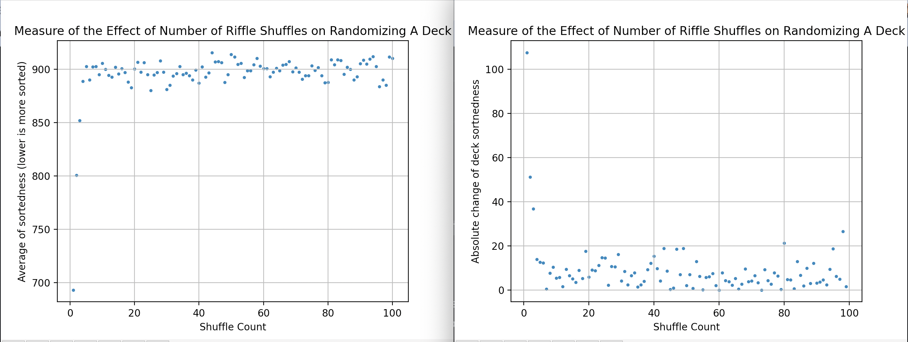

# Riffle Shuffle Deck Analysis
It is known that seven riffle shuffles randomize a deck, where any more than seven don't affect the randomness of a deck.[^1]. Thus, this program is used to analyze the effect of repeatedly riffle shuffling a standard deck of 52 cards by generating a random dataset of shuffles and presenting a scatter plot to visualize the data. 

[^1]: https://math.hmc.edu/funfacts/seven-shuffles/

## Requirements:
```
python          3.10.0
matplotlib      3.5.2
numpy           1.22.4
```

## How To Run:
In the terminal, run:
> `python3 .`

After, you will be prompted to generate a new dataset or not.
 - Choosing `yes` or `y` will generate a new dataset and replace it in `shuffles/averages.txt`.
 - Choosing `no` or `n` will read from `shuffles/averages.txt`.

Either option will result in two plots of data:
 1. The overall average of *sortedness* for each increasing number of shuffles.
 2. The differences between adjacent averages of each increasing number of shuffles.

## Note:
`Card`: To maintain simplicity and speed, no face value is assigned. Instead, a 52-card deck is simply a list of 0 to 52 (exclusive).
`Sortedness`: Defined as the euclidean distance of a deck of cards, where the actual value of a card and its correct position is compared.
```
E.g.
Card: 10
Actual position: 51
Euclidean distance: sqrt(pow(51-10, 2)) = 41
```

Example Dataset:


## Todo:
Graph trendlines on both graphs.